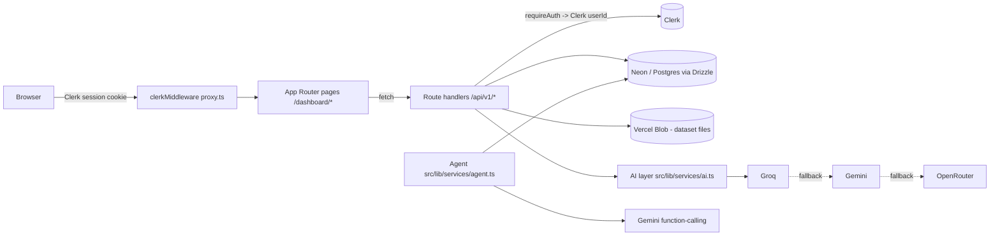

# Nexus AI — Text Intelligence Dashboard

Nexus AI turns raw text data (customer reviews, support tickets, survey responses,
social posts) into actionable intelligence. Upload a CSV or Excel file, map the text
columns, and the platform runs per-row AI analysis (sentiment, emotion, risk,
summary, recommendations), aggregates it into an exploratory dashboard, generates
executive reports, scans for anomalies, and answers free-form questions about your
data through a conversational agent.

Built with **Next.js 16 (App Router)**, **React 19**, **TypeScript**, **Tailwind CSS 4**,
**Clerk** auth, **Drizzle ORM** on **Neon/Postgres**, and a **multi-provider LLM** layer.

---

## Features

- **Upload & map** — CSV / `.xlsx` ingest with auto-detection of likely text columns. The first 500 rows are analyzed per dataset.
- **Batch AI analysis** — each row is classified for sentiment, primary emotion, risk level, key issues, recommendations, and a confidence score.
- **EDA & dashboard** — sentiment/risk/emotion distributions, length bins, confidence and KPI cards, charts (Recharts).
- **AI reports** — one-click executive report (overview, trends, risk assessment, recommendations, metrics).
- **Anomaly alerts** — an AI scan flags spikes and recurring issues at low/medium/high severity.
- **Conversational agent** — ask questions in natural language; the agent queries *your* data through a set of safe, server-controlled tools (see [Security](#security)).

---

## Architecture



- **Auth** — Clerk owns sign-in/sign-up and sessions. Every API route calls `requireAuth()` ([src/lib/api/auth.ts](src/lib/api/auth.ts)) to resolve the Clerk `userId`; **every query is scoped to that id**.
- **Data** — Drizzle schema in [src/lib/db/schema.ts](src/lib/db/schema.ts) (`datasets`, `records`, `reports`, `alerts`). The DB client ([src/lib/db/index.ts](src/lib/db/index.ts)) is a lazy proxy: it picks the Neon HTTP driver for `neon.tech` URLs and node-postgres otherwise, and only connects on first query (so the app builds without a database).
- **AI layer** — [src/lib/services/ai.ts](src/lib/services/ai.ts) is a provider-stacking client: it tries **Groq → Gemini → OpenRouter** in order, using whichever API keys are configured, and falls through on failure.
- **Background processing** — dataset analysis runs in a Next.js `after()` callback ([process route](src/app/api/v1/datasets/[id]/process/route.ts)) so the HTTP response returns immediately. A watchdog in the [status route](src/app/api/v1/datasets/[id]/status/route.ts) marks any job stuck in `processing` for >10 min as `failed`.

---

## Tech stack

| Area | Choice |
| --- | --- |
| Framework | Next.js 16 (App Router, Turbopack), React 19 |
| Language | TypeScript (strict) |
| Styling | Tailwind CSS 4, Radix UI primitives, Framer Motion |
| Auth | Clerk (`@clerk/nextjs`) |
| Database | Neon / Postgres via Drizzle ORM (`drizzle-orm`, `drizzle-kit`) |
| File storage | Vercel Blob (with a local `/tmp` fallback for dev) |
| AI | Groq, Google Gemini, OpenRouter (REST) |
| Charts / state | Recharts, Zustand |
| Tests | Vitest |

---

## Environment variables

Copy [`.env.example`](.env.example) to `.env.local` and fill in:

| Variable | Required | Purpose |
| --- | --- | --- |
| `DATABASE_URL` | ✅ | Postgres / Neon connection string |
| `NEXT_PUBLIC_CLERK_PUBLISHABLE_KEY` | ✅ | Clerk frontend key |
| `CLERK_SECRET_KEY` | ✅ | Clerk backend key |
| `GEMINI_API_KEY` | ◻︎* | Google Gemini (also powers the agent) |
| `GROQ_API_KEY` | ◻︎* | Groq (preferred, fastest fallback tier) |
| `OPENROUTER_API_KEY` | ◻︎* | OpenRouter (last-resort fallback) |
| `BLOB_READ_WRITE_TOKEN` | ◻︎ | Vercel Blob; without it, files use a local `/tmp` fallback |
| `NEXT_PUBLIC_APP_URL` | ◻︎ | Canonical URL for SEO (robots/sitemap/metadata) |
| `DATABASE_SSL_NO_VERIFY` | ◻︎ | Dev-only escape hatch to skip TLS cert verification on self-signed Postgres |

\* At least one AI provider key is required for analysis; the **agent** specifically needs `GEMINI_API_KEY`.

---

## Running locally

**Prerequisites:** Node.js 20+ and a Postgres database (Neon free tier works well).

```bash
npm install
cp .env.example .env.local   # then fill in the values above
npm run dev                  # http://localhost:3000
```

The database schema is created automatically on first server start
([src/instrumentation.ts](src/instrumentation.ts) → `ensureSchema`). The Drizzle
migration is also checked in under [`drizzle/`](drizzle/) for `drizzle-kit` workflows.

### Scripts

| Command | Description |
| --- | --- |
| `npm run dev` | Start the dev server |
| `npm run build` | Production build |
| `npm run typecheck` | `tsc --noEmit` type check |
| `npm test` | Run the Vitest suite |

CI ([`.github/workflows/ci.yml`](.github/workflows/ci.yml)) runs type-check, tests, and a build on every push/PR.

---

## Security

- **Tenant isolation.** Every API route resolves the Clerk `userId` via `requireAuth()` and scopes all Drizzle queries to it.
- **The conversational agent never writes SQL.** Earlier iterations let the model emit raw SQL guarded by string checks — bypassable via prompt injection from dataset content. The agent ([src/lib/services/agent.ts](src/lib/services/agent.ts)) now exposes a fixed set of **typed tools** (sentiment/risk/emotion breakdowns, top records, keyword search, counts, dataset list). The model only supplies *parameters*; the server builds each query with the Drizzle query builder, binds the `userId` as a value, and clamps row limits. Cross-tenant access and SQL injection are impossible by construction.
- **TLS.** The non-Neon Postgres path verifies the server certificate by default; local connections skip TLS, and verification can only be disabled via an explicit dev-only env flag.

---

## Known limitations & future work

This is a feature-complete demo, not yet hardened for large-scale multi-tenant
production. The next steps for real-user deployment:

- **Postgres Row-Level Security** as defense-in-depth on top of application-level `userId` scoping.
- **Durable processing** (Vercel Queues / Workflow) to replace the `after()` background job, with retries and resume.
- **Rate limiting & cost caps** on AI endpoints (e.g. Upstash Redis).
- **Error tracking / observability** (e.g. Sentry) beyond `console.error`.
- **Zod input validation** on all route bodies.
- The `xlsx` dependency carries known advisories with no upstream fix; consider migrating Excel parsing to an alternative for production.
- Analysis is currently capped at 500 rows per dataset (surfaced in the upload UI).
